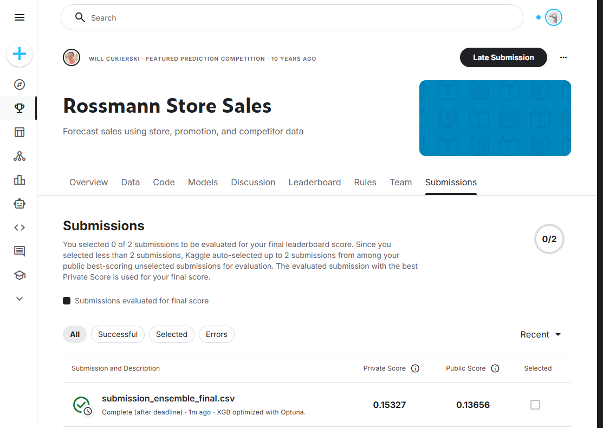

# Desafío Kaggle - Predicción de ventas de las tiendas Rossmann

Mirando el material del curso (clases, notebooks, presentaciones) y apalancado en el LLM de Google (sobre todo para resolver cuestiones de Python que no es un lenguaje que domino) fui armando el Notebook buscando diferentes formas de llegar al mejor score de Kaggle.

Para eso probé varias cosas:

1. Feature Engineering, agregué y quité varias cosas que hicieron variar el score de maneras extremas (posiblemente porque estaba haciendo algo mal). Lo más difícil de que sume fueron las lag windows (ventas de los ultimos 1, 7, 21, etc días). Algunas dieron buenos resultados enseguida (cantidad de días desde y luego de la última promo, cantidad de días antes y después de un feriado estatal o escolar).

2. Entendiendo que XGBoost es el modelo que usó el ganador del challenge, me concentré en optimizar ese. Usando Optuna logré mejorar el score un poco más, pero no demasiado.

3. Todo lo que hice después, empeoraba el score. Hacer ensembles con LightGBM y/o MLP con y sin embeddings me llevaba el score arriba de 0.2/0.3

4. Separar train y test por fecha (tomando 1/1/2015 como fecha de corte) no mejoró necesariamente el score, pero entiendo que es la manera correcta de hacerlo. Después para la submission a Kaggle entendí que era mejor usar todo el dataset.

Para correr el notebook se puede usar VSCode o cualquier otro IDE que soporte devcontainers. De ahi se puede arrancar el devcontainer y debereía instalarse todas las librerias del environment (dev). Descomprimir rossmann.zip en el directorio dataset/. Luego elegir el kernel del entorno dev y ejecutar.

